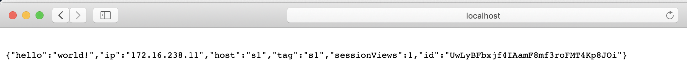
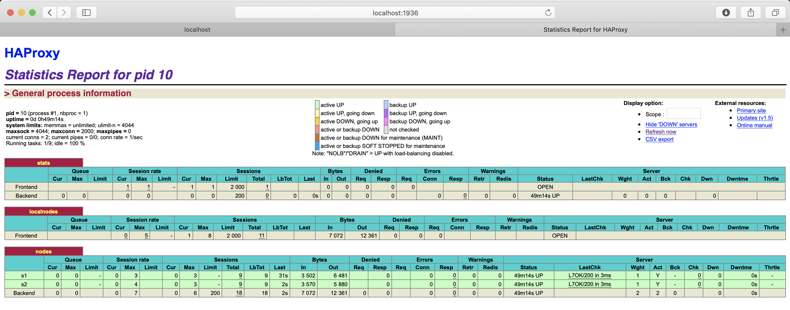
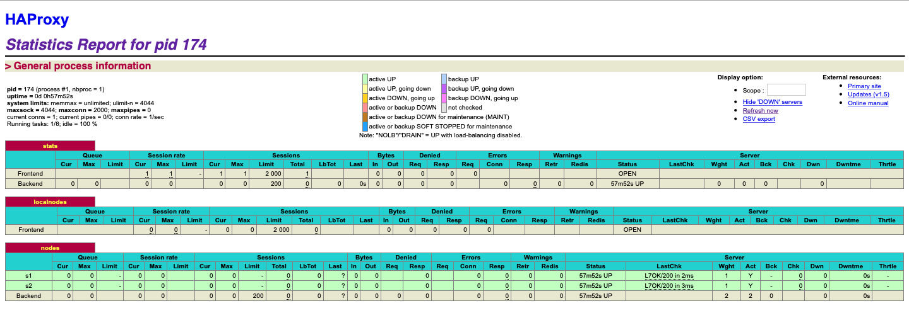

# AIT - Labo 4

[TOC]

## Introduction

An introduction describing briefly the lab

[TODO]

## Task 0

### Questions

*1. Do you think we can use the current solution for a production environment? What are the main problems when deploying it in a production environment?*

La structure du labo précédent ne convient pas à une utilisation en production. En effet, la solution mise en place au labo 3 est beaucoup trop statique et implique trop de downtime en cas de modifications pour être utilisé en production.

*2. Describe what you need to do to add new`webapp` container to the infrastructure. Give the exact steps of what you have to do without modifiying the way the things are done. Hint: You probably have to modify some configuration and script files in a Docker image.*

Il faut modifier le script de provisioning ([re]provision.sh) pour y ajouter des containers webapp supplémentaires. Aussi, il faut adapter la configuration d'HAProxy pour rajouter les noeuds correspondants.

Plus concrètement voici les ajouts que je ferai :

Dans le fichier **provision.sh** (*diff entre l'original et ce que je propose*)

```bash
3,7d2
> if [[ ! ${NUMBER_OF_INSTANCES} ]]; then
> 	echo "First define NUMBER_OF_INSTANCES, for example 'export NUMBER_OF_INSTANCES=10'"
> 	exit 1
> fi
>

33,36c28,31
> for ((i=0; i <NUMBER_OF_INSTANCES; i++)); do
>     sudo docker rm -f s${i} 2>/dev/null || true
>     sudo docker run -d --restart=always -e "TAG=s${i}" --name s${i} softengheigvd/webapp
> done
---
< sudo docker rm -f s1 2>/dev/null || true
< sudo docker rm -f s2 2>/dev/null || true
< sudo docker run -d --restart=always -e "TAG=s1" --name s1 softengheigvd/webapp
< sudo docker run -d --restart=always -e "TAG=s2" --name s2 softengheigvd/webapp

41c36,37
> sudo docker run -d -p 80:80 -p 1936:1936 -p 9999:9999 --restart=always -v /supervisor:/supervisor $(for ((i=0; i <NUMBER_OF_INSTANCES; i++)); do echo "--link s${i} "; done) --name ha softengheigvd/ha
---
< sudo docker run -d -p 80:80 -p 1936:1936 -p 9999:9999 --restart=always -v /supervisor:/supervisor --link s1 --link s2 --name ha softengheigvd/ha
```

Dans le fichier **reprovision.sh** (*diff entre l'original et ce que je propose*)

```bash
> if [[ ! ${NUMBER_OF_INSTANCES} ]]; then
> 	echo "First define NUMBER_OF_INSTANCES, for example 'export NUMBER_OF_INSTANCES=10'"
> 	exit 1
> fi
>

27,29c22,23
> for ((i=0; i <NUMBER_OF_INSTANCES; i++)); do
>     sudo docker run -d --restart=always -e "TAG=s${i}" --name s${i} softengheigvd/webapp
> done
---
< sudo docker run -d --restart=always -e "TAG=s1" --name s1 softengheigvd/webapp
< sudo docker run -d --restart=always -e "TAG=s2" --name s2 softengheigvd/webapp

33c27
> sudo docker run -d -p 80:80 -p 1936:1936 -p 9999:9999 --restart=always -v /supervisor:/supervisor $(for ((i=0; i <NUMBER_OF_INSTANCES; i++)); do echo "--link s${i} "; done) --name ha softengheigvd/ha
---
< sudo docker run -d -p 80:80 -p 1936:1936 -p 9999:9999 --restart=always -v /supervisor:/supervisor --link s1 --link s2 --name ha softengheigvd/ha
\ No newline at end of file
```

Dans le fichier **haproxy.cfg**, ajout d'une ligne '**# !!!BACKENDS_DEFINITION!!!**' pour la substitution des backends au déploiement (en se basant sur la variable d'environnement définie plus haut '**NUMBER_OF_INSTANCES**'). Cette version de la configuration devient une sorte de template

```bash
>     # !!!BACKENDS_DEFINITION!!!
---
<     server s1 <s1>:3000 check
<     server s2 <s2>:3000 check
```

Dans le script **run.sh**

```bash
#!/bin/bash
rsyslogd -c5 2>/dev/null

# if the config file is available in a bind-mounted directory, copy it from there
cp /config/haproxy.cfg /usr/local/etc/haproxy/haproxy.cfg

for ((i=0; i <NUMBER_OF_INSTANCES; i++)); do echo "    server s${i} <s${i}>:3000 check"; done >/tmp/backends
sed -E "/# \!\!\!BACKENDS_DEFINITION\!\!\!/r /tmp/backends" /usr/local/etc/haproxy/haproxy.cfg

haproxy -f /usr/local/etc/haproxy/haproxy.cfg -p /var/run/haproxy.pid
```

Et enfin, dans le fichier **Dockerfile**, rajoute de notre variable d'environnement qui va définir le nombre de backends à déployer au moment du run.

```dockerfile
7a8,9
> ENV NUMBER_OF_INSTANCES 5
>
```

A partir de là on peut stopper les containers, définir cette variable d'environnement au niveau du Dockerfile et reprovisionner l'environnement grâce au script **reprovision.sh**

En prenant, par exemple, 5 instances cela nous donne bien 5 containers avec la webapp, et un container avec le HAProxy qui dispatche les requêtes entre ces 5 backends.

```bash
$ docker ps
CONTAINER ID        IMAGE                     COMMAND                  CREATED             STATUS              PORTS                                                                NAMES
21323a5643fc        docker_custom_haproxy     "/docker-entrypoint.…"   4 seconds ago       Up 2 seconds        0.0.0.0:80->80/tcp, 0.0.0.0:1936->1936/tcp, 0.0.0.0:9999->9999/tcp   ha
5c44574415ef        softengheigvd/webapp:s1   "./run.sh"               17 seconds ago      Up 14 seconds       3000/tcp                                                             s1
0f4a61c7c8a4        softengheigvd/webapp:s2   "./run.sh"               17 seconds ago      Up 14 seconds       3000/tcp                                                             s2
4efb12e8aaa9        softengheigvd/webapp:s4   "./run.sh"               28 seconds ago      Up 26 seconds       3000/tcp                                                             s4
71c8fe7c9bc1        softengheigvd/webapp:s5   "./run.sh"               28 seconds ago      Up 26 seconds       3000/tcp                                                             s5
63eccb3dde0c        softengheigvd/webapp:s3   "./run.sh"               28 seconds ago      Up 26 seconds       3000/tcp                                                             s3
```

Cette configuration va offrir un tout petit plus de souplesse dans le sens où il suffit désormais de définir la variable d'environnement **NUMBER_OF_INSTANCES** pour adapter le nombre de backend. Cependant cette solution n'est pas très robuste ni très dynamique dans le sens où on passe toujours pas une phase de downtime pour ajouter ou retirer des backends. Il faut à chaque fois reprovisionner les containers (voir script **reprovision.sh** plus haut).

*3. Based on your previous answers, you have detected some issues in the current solution. Now propose a better approach at a high level.*

Je propose d'utiliser Docker Swarm. Conformément à la documentation cette solution semble toute désignée pour addresser les problèmes évoqués dans les questions 1 et 2. 

https://docs.docker.com/engine/swarm/

*4. You probably noticed that the list of web application nodes is hardcoded in the load balancer configuration. How can we manage the web app nodes in a more dynamic fashion?*

On pourrait utiliser un template.

*5. Do you think our current solution is able to run additional management processes beside the main web server / load balancer process in a container? If no, what is missing / required to reach the goal? If yes, how to proceed to run for example a log forwarding process?*

Les containers tels que définis actuellement ne sont pas designés pour exécuter d'autres processus en parallèle.

*6. What happens if we add more web server nodes? Do you think it is really dynamic? It's far away from being a dynamic configuration. Can you propose a solution to solve this?*

Effectivement une telle solution est loin d'etre dynamique. La solution serait d'avoir un superviseur qui serait capable d'orchestrer le scaling en fonction du nombre de requêtes.

### Tool installation

Comme mentionné dans mon rapport du précédent labo, j'ai rencontré des problèmes avec Vagrant qui m'ont empêché de mettre en place le setup tel que demandé. Malheureusement le problème n'étant à ce jour toujours pas résolu, je ferai à nouveau abstraction de Vagrant dans ce laboratoire et utiliserai Docker-machine directement sur ma machine hôte.

### Setup de l'environnement

**docker-compose.yml** : à ce stade, identique à celui du labo précédent

```yaml
version: '3.3'
networks:
  app_net:
    driver: bridge
    ipam:
      driver: default
      config:
      - subnet: 172.16.238.0/24
services:
  haproxy:
    build:
      context: ./ha
      dockerfile: Dockerfile
    container_name: ha
    restart: always
    ports:
      - "80:80"
      - "1936:1936"
      - "9999:9999"
    links:
      - webapp1
      - webapp2
    environment:
      - S1_PORT_3000_TCP_ADDR=172.16.238.11
      - S2_PORT_3000_TCP_ADDR=172.16.238.12
    networks:
      app_net:
        ipv4_address: 172.16.238.10
  webapp1:
    image: softengheigvd/webapp:s1
    build:
      context: ./webapp
      dockerfile: Dockerfile
    container_name: s1
    restart: always
    expose:
      - "3000"
    environment:
      - SERVER_TAG=s1
      - SERVER_NAME=s1
      - SERVER_IP=172.16.238.11
    networks:
      app_net:
        ipv4_address: 172.16.238.11
  webapp2:
    image: softengheigvd/webapp:s2
    build:
      context: ./webapp
      dockerfile: Dockerfile
    container_name: s2
    restart: always
    expose:
      - "3000"
    environment:
      - SERVER_TAG=s2
      - SERVER_NAME=s2
      - SERVER_IP=172.16.238.12
    networks:
      app_net:
        ipv4_address: 172.16.238.12
```

Vérification que les instances tournent bien

```bash
$ docker ps

CONTAINER ID        IMAGE                     COMMAND                  CREATED             STATUS              PORTS                                                                NAMES
401696465b86        novagrant_haproxy         "/docker-entrypoint.…"   About an hour ago   Up About an hour    0.0.0.0:80->80/tcp, 0.0.0.0:1936->1936/tcp, 0.0.0.0:9999->9999/tcp   ha
39585f04808b        softengheigvd/webapp:s1   "./run.sh"               About an hour ago   Up About an hour    3000/tcp                                                             s1
f9ce8714cb92        softengheigvd/webapp:s2   "./run.sh"               About an hour ago   Up About an hour    3000/tcp                                                             s2
```

Test d'une requête HTTP GET sur le point d'entrée **localhost**, notre proxy HTTP (HAProxy).

```bash
$ curl -s http://localhost | jq -r
{
  "hello": "world!",
  "ip": "172.16.238.11",
  "host": "s1",
  "tag": "s1",
  "sessionViews": 1,
  "id": "OUgIiV02wq4FmXwH95Y00nXUu7CD5qo1"
}
```





**URL du repo** : https://github.com/Callisto88/AIT_Labo4

## Task 1

*Replace the `TODO: [S6] Install` with the following Docker [...] Take the opportunity to change the `MAINTAINER` of the image by your [...]*

Version mise à jour du fichier **Dockerfile** pour l'image **webapp** (update du MAINTAINER et ajout de la commande RUN pour l'installation de S6)

```dockerfile
# The base image is one of the offical one
FROM node:0.12.2-wheezy

MAINTAINER Cyril de Bourgues <cyril.debourgues@heig-vd.ch>

# Install the required tools to run our webapp and some utils
RUN apt-get update && apt-get -y install wget curl vim && npm install -g bower

# We copy the application and make sure the dependencies are installed before
# other operations. Doing so will reduce the time required to build this image
# as downloading NPM dependencies can be quite long.
COPY app /backend/app
RUN cd /backend/app && npm install && bower install --allow-root

RUN curl -sSLo /tmp/s6.tar.gz https://github.com/just-containers/s6-overlay/releases/download/v1.17.2.0/s6-overlay-amd64.tar.gz \
  && tar xzf /tmp/s6.tar.gz -C / \
  && rm -f /tmp/s6.tar.gz

[...]
```

Mise à jour du fichier **Dockerfile** pour l'image d'**HAProxy**. Mêmes modifications que pour l'image de la webapp. (MAINTAINER et S6)

```dockerfile
# Base image is the Official HAProxy
FROM haproxy:1.5

MAINTAINER Cyril de Bourgues <cyril.debourgues@heig-vd.ch>

# Install some tools
# TODO: [HB] Update to install required tool to install NodeJS
RUN apt-get update && apt-get -y install wget curl vim rsyslog

RUN curl -sSLo /tmp/s6.tar.gz https://github.com/just-containers/s6-overlay/releases/download/v1.17.2.0/s6-overlay-amd64.tar.gz \
  && tar xzf /tmp/s6.tar.gz -C / \
  && rm -f /tmp/s6.tar.gz
  
[...]
```

Rebuild des images pour prendre en compte les modifications

Rebuild de l'image **HAProxy**

```bash
mbp-de-cyril-2:noVagrant cyril$ cd ha/
mbp-de-cyril-2:ha cyril$ docker build -t softengheigvd/ha .
Sending build context to Docker daemon  11.78kB
Step 1/12 : FROM haproxy:1.5
 ---> c502bc6681e3
Step 2/12 : MAINTAINER Cyril de Bourgues <cyril.debourgues@heig-vd.ch>
 ---> Running in 71a9372d8e89
Removing intermediate container 71a9372d8e89
 ---> b83396efab1d
Step 3/12 : RUN apt-get update && apt-get -y install wget curl vim rsyslog
 ---> Running in 8571179e1230
Ign:1 http://cdn-fastly.deb.debian.org/debian stretch InRelease
Get:2 http://cdn-fastly.deb.debian.org/debian stretch-updates InRelease [91.0 kB]
Get:3 http://cdn-fastly.deb.debian.org/debian stretch Release [118 kB]

[...]

Setting up curl (7.52.1-5+deb9u8) ...
Processing triggers for libc-bin (2.24-11+deb9u3) ...
Processing triggers for ca-certificates (20161130+nmu1+deb9u1) ...
Updating certificates in /etc/ssl/certs...
0 added, 0 removed; done.
Running hooks in /etc/ca-certificates/update.d...
done.
Removing intermediate container 8571179e1230
 ---> 7fdf7a3d9cf5
Step 4/12 : RUN curl -sSLo /tmp/s6.tar.gz https://github.com/just-containers/s6-overlay/releases/download/v1.17.2.0/s6-overlay-amd64.tar.gz   && tar xzf /tmp/s6.tar.gz -C /   && rm -f /tmp/s6.tar.gz
 ---> Running in b99ec76d17bd
Removing intermediate container b99ec76d17bd
 ---> 693954744608
Step 5/12 : COPY scripts/ /scripts/
 ---> c6582195951c
Step 6/12 : RUN chmod +x /scripts/*.sh
 ---> Running in 842175630b46
Removing intermediate container 842175630b46
 ---> 15e1aedc46d0
Step 7/12 : COPY config/haproxy.cfg /usr/local/etc/haproxy/haproxy.cfg
 ---> d6c0bd9260da
Step 8/12 : COPY config/rsyslogd.cfg /etc/rsyslog.d/49-haproxy.conf
 ---> c21ffa3dec76
Step 9/12 : RUN apt-get clean && rm -rf /var/lib/apt/lists/* /tmp/* /var/tmp/*
 ---> Running in b8317aa3a67e
Removing intermediate container b8317aa3a67e
 ---> 23a97100b84d
Step 10/12 : EXPOSE 80 1936
 ---> Running in 4b9fc3e21e82
Removing intermediate container 4b9fc3e21e82
 ---> 99c72704f4a4
Step 11/12 : ENV ROLE balancer
 ---> Running in 544d28e2646a
Removing intermediate container 544d28e2646a
 ---> 48a7baf80f5e
Step 12/12 : CMD [ "/scripts/run.sh" ]
 ---> Running in af4654d2062d
Removing intermediate container af4654d2062d
 ---> 34bc84c82b9a
Successfully built 34bc84c82b9a
Successfully tagged softengheigvd/ha:latest
mbp-de-cyril-2:ha cyril$
```

Rebuild de **webapp**

```bash
mbp-de-cyril-2:noVagrant cyril$ cd webapp/
mbp-de-cyril-2:webapp cyril$ docker build -t softengheigvd/webapp .
Sending build context to Docker daemon  31.74kB
Step 1/12 : FROM node:0.12.2-wheezy
 ---> 51625719dd87
Step 2/12 : MAINTAINER Cyril de Bourgues <cyril.debourgues@heig-vd.ch>
 ---> Running in 864cf89da2e5
Removing intermediate container 864cf89da2e5
 ---> cb3c6e2bd81a
Step 3/12 : RUN apt-get update && apt-get -y install wget curl vim && npm install -g bower
 ---> Running in a4a5dd987776
Get:1 http://httpredir.debian.org wheezy Release.gpg [2373 B]
Get:2 http://security.debian.org wheezy/updates Release.gpg [1601 B]
Get:3 http://httpredir.debian.org wheezy-updates Release.gpg [1601 B]

[...]

thread-sleep@1.0.4 node_modules/thread-sleep
└── nan@2.11.1
{}
Removing intermediate container 7d9a14716c5b
 ---> b5e869e339eb
Step 6/12 : RUN curl -sSLo /tmp/s6.tar.gz https://github.com/just-containers/s6-overlay/releases/download/v1.17.2.0/s6-overlay-amd64.tar.gz   && tar xzf /tmp/s6.tar.gz -C /   && rm -f /tmp/s6.tar.gz
 ---> Running in 9f3bb7b2a943
Removing intermediate container 9f3bb7b2a943
 ---> 612d77ce8211
Step 7/12 : COPY scripts /scripts/
 ---> 2c83eb0ea8ce
Step 8/12 : RUN chmod +x /scripts/*.sh
 ---> Running in 57041b650bfb
Removing intermediate container 57041b650bfb
 ---> ee7ebdbc3cea
Step 9/12 : RUN apt-get clean && rm -rf /var/lib/apt/lists/* /tmp/* /var/tmp/*
 ---> Running in f7daf2e068ce
Removing intermediate container f7daf2e068ce
 ---> 0505e2114360
Step 10/12 : EXPOSE 3000
 ---> Running in 6cc4b86cf42f
Removing intermediate container 6cc4b86cf42f
 ---> 838de156eac9
Step 11/12 : ENV ROLE backend
 ---> Running in 56097c8ffc27
Removing intermediate container 56097c8ffc27
 ---> f8308985744a
Step 12/12 : CMD [ "/scripts/run.sh" ]
 ---> Running in ba127428bf2e
Removing intermediate container ba127428bf2e
 ---> 6651c9c853bf
Successfully built 6651c9c853bf
Successfully tagged softengheigvd/webapp:latest
mbp-de-cyril-2:webapp cyril$
```

Au passage, j'en profite pour modifier le script **build-images.sh** pour qu'il corresponde à mon environnement (càd sans la couche Vagrant), j'utiliserai dès lors ce script pour rebuild les images.

```bash
$ diff --suppress-common-lines build-images.sh build-images-novagrant.sh
5c5
< cd /vagrant/ha
---
> cd ha
10c10
< cd /vagrant/webapp
---
> cd ../webapp
```

*To start the containers, first you need to stop the current containers and remove them. You can do that with the following commands:  [...] and restart them*

*[... ] or you can use the script to start two base containers*

Dans mon cas, j'utilise la commande ```docker-compose up -d --build --force-recreate``` pour forcer le rebuild des images et relancer les containers en me basant sur les instructions du fichier docker-compose.yml exposé au début.

*You can check the state of your containers as we already did it in previous task [...]*

```bash
$ docker ps
CONTAINER ID        IMAGE                  COMMAND                  CREATED             STATUS              PORTS                                                                NAMES
65480d6e7741        softengheigvd/ha       "/docker-entrypoint.…"   2 minutes ago       Up 2 minutes        0.0.0.0:80->80/tcp, 0.0.0.0:1936->1936/tcp, 0.0.0.0:9999->9999/tcp   ha
289f248b0aa6        softengheigvd/webapp   "/scripts/run.sh"        3 minutes ago       Up 2 minutes        3000/tcp                                                             s2
910ba1ee645e        softengheigvd/webapp   "/scripts/run.sh"        3 minutes ago       Up 2 minutes        3000/tcp                                                             s1
```

*We need to configure `S6` as our main process [...] update our Docker images HAProxy and the web application and replace the: `TODO: [S6] Replace the following instruction` by the following [...]*

Version mise à jour du **Dockerfile**

```dockerfile
[...]

# This will start S6 as our main process in our container
ENTRYPOINT ["/init"]
```

*Let's start by creating a folder called `service` in `ha` and `webapp` folders.*

```bash
mbp-de-cyril-2:noVagrant cyril$ mkdir -p ha/services/ha webapp/services/node
mbp-de-cyril-2:noVagrant cyril$ tree -L 3
.
[...]
├── ha
│   ├── Dockerfile
│   ├── config
│   │   ├── haproxy.cfg
│   │   └── rsyslogd.cfg
│   ├── scripts
│   │   └── run.sh
│   └── services
│       └── ha
[...]
└── webapp
    ├── Dockerfile
    ├── app
    │   ├── Gruntfile.js
    │   ├── app
    │   ├── app.js
    │   ├── bower.json
    │   ├── config
    │   ├── package.json
    │   └── public
    ├── scripts
    │   └── run.sh
    └── services
        └── node
```

*We need to copy the `run.sh` scripts as `run` files in the service directories. [...]*

Copie des scripts dans les sous-répertoires services

```bash
$ cp ha/scripts/run.sh ha/services/ha/run && chmod +x ha/services/ha/run
$ cp webapp/scripts/run.sh webapp/services/node/run && chmod +x webapp/services/node/run
```

*Once copied, replace the hashbang instruction in <u>both files.</u> Replace the first line of the `run` script*

Remplacement du hashbang dans les scripts **run**

Pour **haproxy**

```bash
#!/usr/bin/with-contenv bash
rsyslogd -c5 2>/dev/null
[...]
```

Pour **webapp**

```bash
#!/usr/bin/with-contenv bash
[...]
```

*In `ha` Docker file, you need to replace: `TODO: [S6] Replace the two following instructions` by*

Fichier **ha/Dockerfile**, mis à jour

```bash
[...]

RUN curl -sSLo /tmp/s6.tar.gz https://github.com/just-containers/s6-overlay/releases/download/v1.17.2.0/s6-overlay-amd64.tar.gz \
  && tar xzf /tmp/s6.tar.gz -C / \
  && rm -f /tmp/s6.tar.gz

# TODO: [Serf] Install

# TODO: [HB] Install NodeJS

# TODO: [HB] Install Handlebars

# Copy the S6 service and make the run script executable
COPY services/ha /etc/services.d/ha
RUN chmod +x /etc/services.d/ha/run

[...]
```

*Do the same in the `webapp`Docker file*

Fichier **webapp/Dockerfile**, mis à jour

```bash
[...]

RUN curl -sSLo /tmp/s6.tar.gz https://github.com/just-containers/s6-overlay/releases/download/v1.17.2.0/s6-overlay-amd64.tar.gz \
  && tar xzf /tmp/s6.tar.gz -C / \
  && rm -f /tmp/s6.tar.gz

# TODO: [Serf] Install

# Copy the S6 service and make the run script executable
COPY services/node /etc/services.d/node
RUN chmod +x /etc/services.d/node/run

[...]
```

*Build again your images and run them. [...]*

Puis rebuild des deux containers et run

```bash
$ docker-compose up -d --build --force-recreate
Building webapp1
Step 1/16 : FROM node:0.12.2-wheezy
 ---> 51625719dd87
 [...]
 
Successfully built f9f983588d45
Successfully tagged novagrant_haproxy:latest
Recreating s2 ... done
Recreating s1 ... done
Recreating ha ... done
```

*Deliverables*

Statistiques d'HAProxy



[TODO]

## Task 2

Ajout des instructions d'installation dans les Dockerfile d'HAProxy et webapp

```bash
[...]

RUN curl -sSLo /tmp/s6.tar.gz https://github.com/just-containers/s6-overlay/releases/download/v1.17.2.0/s6-overlay-amd64.tar.gz \
  && tar xzf /tmp/s6.tar.gz -C / \
  && rm -f /tmp/s6.tar.gz

# Install serf (for decentralized cluster membership: https://www.serf.io/)
RUN mkdir /opt/bin \
    && curl -sSLo /tmp/serf.gz https://releases.hashicorp.com/serf/0.7.0/serf_0.7.0_linux_amd64.zip \
    && gunzip -c /tmp/serf.gz > /opt/bin/serf \
    && chmod 755 /opt/bin/serf \
    && rm -f /tmp/serf.gz

# Copy the S6 service and make the run script executable
COPY services/node /etc/services.d/node
RUN chmod +x /etc/services.d/node/run

[...]
```

Puis rebuild des deux images (ha et webapp)

```bash
$ ./build-images-novagrant.sh
************************  build haproxy image  ************************
Sending build context to Docker daemon  17.92kB
Step 1/16 : FROM haproxy:1.5
 ---> c502bc6681e3
 [...]
 
Successfully built 59ce481a3ea3
Successfully tagged softengheigvd/ha:latest
************************  build webapp image  ************************
Sending build context to Docker daemon  37.89kB
Step 1/16 : FROM node:0.12.2-wheezy
 ---> 51625719dd87
 [...]
```

Création des répertoires serf pour la gestion des services par S6

```bash
$ mkdir ha/services/serf webapp/services/serf
```

Nouvelle structure

```bash
$ tree -L 3 ha/ webapp/
ha/
├── Dockerfile
├── config
│   ├── haproxy.cfg
│   └── rsyslogd.cfg
├── scripts
│   └── run.sh
└── services
    ├── ha
    │   └── run
    └── serf
webapp/
├── Dockerfile
├── app
│   ├── Gruntfile.js
│   ├── app
│   │   ├── controllers
│   │   ├── models
│   │   └── views
│   ├── app.js
│   ├── bower.json
│   ├── config
│   │   ├── config.js
│   │   └── express.js
│   ├── package.json
│   └── public
│       └── css
├── scripts
│   └── run.sh
└── services
    ├── node
    │   └── run
    └── serf

17 directories, 14 files
```

Création des fichiers **run**

```bash
$ touch ha/services/serf/run && chmod +x ha/services/serf/run
$ touch webapp/services/serf/run && chmod +x webapp/services/serf/run
```

*In the `ha/services/serf/run` file, add the following script. This will start and enable the capabilities of `Serf` on the load balancer.*

Ajout du contenu du script dans le fichier **ha/services/serf/run**

```bash
[...]

# ##############################################################################
# SERF START
# ##############################################################################

# We build the Serf command to run the agent
COMMAND="/opt/bin/serf agent"
COMMAND="$COMMAND --join ha"
COMMAND="$COMMAND --replay"
COMMAND="$COMMAND --event-handler member-join=/serf-handlers/member-join.sh"
COMMAND="$COMMAND --event-handler member-leave,member-failed=/serf-handlers/member-leave.sh"
COMMAND="$COMMAND --tag role=$ROLE"

# ##############################################################################
# SERF END
# ##############################################################################

[...]
```

*[...] Anyway, in our current solution, there is kind of misconception around the way we create the `Serf` cluster. In the deliverables, describe which problem exists with the current solution based on the previous explanations and remarks. Propose a solution to solve the issue.*

[TODO]

*To make sure that `ha` load balancer can leave and enter the cluster again, we add the `--replay` option. This will make the Serf agent replay the past events and then react to these events. In fact, due to the problem you have to guess, this will probably not be really useful.*

[TODO]


*Let's prepare the same kind of configuration. Copy the `run` file you just created in `webapp/services/serf` and replace the content between `SERF START` and `SERF END` by the following one:*

Extrait du fichier **webapp/services/serf/run**, mis à jour

```bash
[...]

# ##############################################################################
# SERF START
# ##############################################################################

# We build the Serf command to run the agent
# We build the Serf command to run the agent
COMMAND="/opt/bin/serf agent"
COMMAND="$COMMAND --join ha"
COMMAND="$COMMAND --tag role=$ROLE"

# ##############################################################################
# SERF END
# ##############################################################################

[...]
```

*[...] In both Docker image files, in the [ha](ha) and [webapp](webapp) folders, replace `TODO: [Serf] Add Serf S6 setup` with the instruction to copy the Serf agent run script and to make it executable.*

Dans les fichiers **webapp/Dockerfile** et **ha/Dockerfile** on ajoute les instructions nécessaires pour copier les scripts **run** vers **/etc/services.d/** dans chacun des containers (ha & webapp)

```dockerfile
[...]

COPY services/serf /etc/services.d/serf
RUN chmod +x /etc/services.d/serf/run

[...]
```

*And finally, you can expose the `Serf` ports through your Docker image files.*

Exposition des ports pour Serf

dans **webapp**

```dockerfile
[...]

# Expose the ports for Serf
EXPOSE 7946 7373

# Expose the web application port
EXPOSE 3000

[...]
```

dans **ha**

```dockerfile
[...]

# Expose the ports for Serf
EXPOSE 7946 7373

# Expose the HA proxy ports
EXPOSE 80 1936

[...]
```

*It's time to build the images and to run the containers*

Enfin, rebuild des images existants puis exécution des containers

```bash
$ docker-compose up -d --build --force-recreate
Creating network "novagrant_app_net" with driver "bridge"
Creating s2 ... done
Creating s1 ... done
Creating ha ... done
mbp-de-cyril-2:noVagrant cyril$
mbp-de-cyril-2:noVagrant cyril$ docker ps
CONTAINER ID        IMAGE                     COMMAND                  CREATED             STATUS              PORTS                                                                NAMES
dc49fb453c4c        novagrant_haproxy         "/docker-entrypoint.…"   5 seconds ago       Up 4 seconds        0.0.0.0:80->80/tcp, 0.0.0.0:1936->1936/tcp, 0.0.0.0:9999->9999/tcp   ha
d66b99f8c717        softengheigvd/webapp:s2   "./run.sh"               6 seconds ago       Up 5 seconds        3000/tcp                                                             s2
3c20b7b231d0        softengheigvd/webapp:s1   "./run.sh"               6 seconds ago       Up 5 seconds        3000/tcp                                                             s1
```

*[...] At this stage, you should have your application running [...]*

Vérification du bon fonctionnement avec des appels **curl**

```bash
$ curl -s http://localhost | jq -r
{
  "hello": "world!",
  "ip": "172.16.238.11",
  "host": "s1",
  "tag": "s1",
  "sessionViews": 1,
  "id": "PLXBEoeKCqQXDDTvw17vhW2hgfttZXwZ"
}
$ curl -s http://localhost | jq -r
{
  "hello": "world!",
  "ip": "172.16.238.12",
  "host": "s2",
  "tag": "s2",
  "sessionViews": 1,
  "id": "tXxATPbO7z7dNN99Mr3f48fbdPFloHM_"
}
$ curl -s http://localhost | jq -r
{
  "hello": "world!",
  "ip": "172.16.238.11",
  "host": "s1",
  "tag": "s1",
  "sessionViews": 1,
  "id": "smAB6RtZARs3MzTKEjYDuIgBbEWiTIG1"
}
$ curl -s http://localhost | jq -r
{
  "hello": "world!",
  "ip": "172.16.238.12",
  "host": "s2",
  "tag": "s2",
  "sessionViews": 1,
  "id": "st8YK4hngjdJBFmkfnImrDiSDYE8Awu_"
}
```

*[...] you can check the Docker logs to see what is happening [...]*

Détaillons les logs du container **s2**

Premières entrées des logs, démarrage des services et routines de check.  Notez le champ **RPC addr** avec pour valeur **127.0.0.1:7373**. Il s'agit bien du port exposé tel que défini dans le Dockerfile. C'est sur ce port, sur l'adresse de loopback du container que Serf va communiquer.

```bash
$ docker logs s2
[s6-init] making user provided files available at /var/run/s6/etc...exited 0.
[s6-init] ensuring user provided files have correct perms...exited 0.
[fix-attrs.d] applying ownership & permissions fixes...
[fix-attrs.d] done.
[cont-init.d] executing container initialization scripts...
[cont-init.d] done.
[services.d] starting services
[services.d] done.
/opt/bin/serf agent --join ha --tag role=backend
==> Starting Serf agent...
==> Starting Serf agent RPC...
==> Serf agent running!
         Node name: '900b29a95f61'
         Bind addr: '0.0.0.0:7946'
          RPC addr: '127.0.0.1:7373'
         Encrypted: false
          Snapshot: false
           Profile: lan
==> Joining cluster...(replay: false)
    Join completed. Synced with 1 initial agents
    [...]
```

Premiers événements de l'agent Serf

*You will notice the following in the logs (or something similar). ```==> Joining cluster...(replay: false)
==> lookup ha on 10.0.2.3:53: no such host```*

En fait pas dans mon cas, les hôtes peuvent déjà communiquer entre eux car ayant repris mon fichier docker-compose.yml du précédent labo, la partie réseau est déjà définie :

En fait pas dans mon cas ; en effet ayant repris mon fichier **docker-compose.yml**, la partie réseau est déjà en place.  Par contre je l'avais nommé différemment, donc je renomme juste le nom du réseau, initialement je l'avais nommé **app_net**, en **heig** pour coller à la donnée du labo

Détails de la configuration réseau dans le fichier **docker-compose.yml**

```dockerfile
version: '3.3'
networks:
  heig:
    driver: bridge
    ipam:
      driver: default
      config:
      - subnet: 172.16.238.0/24
      [...]
 services:
  haproxy:     	
    [...]
    environment:
      - S1_PORT_3000_TCP_ADDR=172.16.238.11
      - S2_PORT_3000_TCP_ADDR=172.16.238.12
    networks:
      heig:
        ipv4_address: 172.16.238.10
  webapp1:
    environment:
      [...]
      - SERVER_IP=172.16.238.11
    networks:
      heig:
        ipv4_address: 172.16.238.11
        [...]
  webapp2:
    [...]
    environment:
      [...]
      - SERVER_IP=172.16.238.12
    networks:
      heig:
        ipv4_address: 172.16.238.12
```

Rebuild des images pour prendre en compte le nouveau nom du réseau

```bash
$ docker-compose up -d --build --force-recreate
Creating network "novagrant_heig" with driver "bridge"
Building webapp1
```

<u>NB</u> : vous remarquerez probablement que le nom effectif du réseau affiché lors du build des images et du run des containers et **novagrant_heig**. Cela vient du fait que Docker-compose préfixe tous les réseaux et service avec le nom du dossier où se trouve le fichier docker-compose.yml.

Ce paramètre peut être surchargé grâce à l'option **-p**

<u>Réf</u> : https://docs.docker.com/compose/reference/overview/#use--p-to-specify-a-project-name

Ce qui permet aux containers de déjà se causer.

```
==> Log data will now stream in as it occurs:

    2018/12/29 14:08:54 [INFO] agent: Serf agent starting
    2018/12/29 14:08:54 [INFO] serf: EventMemberJoin: 900b29a95f61 172.16.238.12
    2018/12/29 14:08:54 [INFO] agent: joining: [ha] replay: false
    2018/12/29 14:08:54 [INFO] serf: EventMemberJoin: eaae743dc511 172.16.238.10
    2018/12/29 14:08:54 [INFO] serf: EventMemberJoin: aedde91bb3f1 172.16.238.11
    2018/12/29 14:08:54 [INFO] agent: joined: 1 nodes
Application started
[...]
```

Revenons aux logs. Autre point intéressant dans ceux de **s2** ; les requêtes HTTP HEAD. 

On voit qu'elle retourne bien un code de statut 200. Tout va bien.

```bash
[...]
HEAD / 200 13.019 ms - 114
HEAD / 200 5.728 ms - 114
HEAD / 200 1.412 ms - 114
HEAD / 200 2.487 ms - 114
[...]
```

Mais pourquoi des requêtes HEAD ? D'où viennent elles ?

**Explication** :

Cela viens d'HAProxy qui test ses backends à intervalle régulier.

Dans le fichier **ha/config/haproxy.cfg**, noter l'instruction **option httpchk** avec la méthode **HEAD**

```bash
[...]
backend nodes
	[...]
	
    # Define the way the backend nodes are checked to know if they are alive or down
    # http://cbonte.github.io/haproxy-dconv/configuration-1.5.html#4-option%20httpchk
    option httpchk HEAD /
    
    [...]
```

Voyons maintenant les logs dans le container **ha**

Je vais détailler quelques extraits de ce log.

Pour commencer :

```bash
[s6-init] making user provided files available at /var/run/s6/etc...exited 0.
[s6-init] ensuring user provided files have correct perms...exited 0.
[fix-attrs.d] applying ownership & permissions fixes...
[fix-attrs.d] done.
[cont-init.d] executing container initialization scripts...
[cont-init.d] done.
[services.d] starting services
[services.d] done.
```

On peut voir qu'il y a quelques routines de check qui sont effectués : vérification puis fix des permissions, initialisation de scripts et enfin démarrage du service.

*Notons le code sortie des deux premières lignes : **exited 0** qui indique que l'instruction s'est exécutée avec succès.*

Autre point intéressant, l'instanciation de serf

```bash
/opt/bin/serf agent --join ha --replay --event-handler member-join=/serf-handlers/member-join.sh --event-handler member-leave,member-failed=/serf-handlers/member-leave.sh --tag role=balancer
==> Starting Serf agent...
==> Starting Serf agent RPC...
==> Serf agent running!
         Node name: '7ee4a1a1540f'
         Bind addr: '0.0.0.0:7946'
          RPC addr: '127.0.0.1:7373'
         Encrypted: false
          Snapshot: false
           Profile: lan
```

Cela est conforme à ce que nous avions défini dans **ha/services/serf/run**

```bash
[...]
# We build the Serf command to run the agent
COMMAND="/opt/bin/serf agent"
COMMAND="$COMMAND --join ha"
COMMAND="$COMMAND --replay"
COMMAND="$COMMAND --event-handler member-join=/serf-handlers/member-join.sh"
COMMAND="$COMMAND --event-handler member-leave,member-failed=/serf-handlers/member-leave.sh"
COMMAND="$COMMAND --tag role=$ROLE"
[...]
```

Maintenant venons en à la partie qui nous intéresse, les événements. On peut déjà voir que juste après le démarrage de l'agent serf il y a déjà le membre **ha** qui se joint à serf, normal il est sur sa propre instance.

```bash
==> Joining cluster...(replay: true)
    Join completed. Synced with 1 initial agents

==> Log data will now stream in as it occurs:

    2018/12/28 14:28:41 [INFO] agent: Serf agent starting
    2018/12/28 14:28:41 [INFO] serf: EventMemberJoin: 7ee4a1a1540f 172.16.238.10
    2018/12/28 14:28:41 [INFO] agent: joining: [ha] replay: true
    2018/12/28 14:28:41 [INFO] agent: joined: 1 nodes
```

On remarque cependant une erreur à l'invocation du script **/serf-handlers/member-join.sh** 

```bash
    2018/12/28 14:28:42 [INFO] agent: Received event: member-join
    2018/12/28 14:28:42 [ERR] agent: Error invoking script '/serf-handlers/member-join.sh': exit status 127
```

Normal puisque comme mentionné dans la donnée : *At the moment the `member-join` and `member-leave` scripts are missing.*

Donc pas de souci.

*Let's prepare the same kind of configuration. Copy the `run` file you just created in`webapp/services/serf` and replace the content between `SERF START` and `SERF END`*

Extrait du fichier **webapp/services/serf/run** mis à jour :

```bash
[...]
# ##############################################################################
# SERF START
# ##############################################################################

# We build the Serf command to run the agent
COMMAND="/opt/bin/serf agent"
COMMAND="$COMMAND --join ha"
COMMAND="$COMMAND --tag role=$ROLE"

# ##############################################################################
# SERF END
# ##############################################################################
[...]
```

*The `$ROLE` is also replaced by the `-e "ROLE=backend"` from the Docker `run` command.*

Ci-dessous l'instruction en question, définition d'une variable d'environnement transmise dans le container au moment de son exécution

```bash
[...]
# Define an environment variable for the role of the container
ENV ROLE backend
[...]
```

<u>Réf</u> : https://docs.docker.com/compose/environment-variables/

And finally, you can expose the `Serf` ports through your Docker image files.*

```bash
[...]
# Expose the ports for Serf
EXPOSE 7946 7373
[...]
```

( Excellent article sur la différence entre **expose** et **publish** : https://medium.freecodecamp.org/expose-vs-publish-docker-port-commands-explained-simply-434593dbc9a3 )

Rebuild des images Docker pour prendre en compte les dernières modifications

```bash
$ docker-compose up -d --build --force-recreate
```

***Cleanup***

*As we have changed the way we start our reverse proxy and web application, we can remove the original `run.sh` scripts.*

Dans mon cas sans le **/vagrant** au début

```bash
$ rm ha/scripts/run.sh
$ rm -r webapp/scripts/
```

A noter que dans ces fichiers run.sh on utilisait ceci :

```bash
sed -i 's/<s1>/$S1_PORT_3000_TCP_ADDR/g' /usr/local/etc/haproxy/haproxy.cfg
sed -i 's/<s2>/$S2_PORT_3000_TCP_ADDR/g' /usr/local/etc/haproxy/haproxy.cfg
```

Les variables d'environnements **S1_PORT_3000_TCP_ADDR** et **S2_PORT_3000_TCP_ADDR** étant définies dans mon fichier **docker-compose.yml** je les retire également.

```bash
$ diff --suppress-common-lines docker-compose.yml_old docker-compose.yml
23,25d22
<     environment:
<       - S1_PORT_3000_TCP_ADDR=172.16.238.11
<       - S2_PORT_3000_TCP_ADDR=172.16.238.12
```

***Deliverables***

*1. Provide the docker log output for each of the containers. [...]*

```bash
$ docker logs ha > logs/task2/ha.log
$ docker logs s1 > logs/task2/s1.log
$ docker logs s2 > logs/task2/s2.log
```

*2. Give the answer to the question about the existing problem with the current solution.*

[TODO]

*3. Give an explanation on how `Serf` is working. [...]*

[TODO]

Serf is really simple to use as it lets the user write their own shell scripts to react to the cluster events. In this task we will write the first bits and pieces of the handler scripts we need to build our solution. 

We will start by just logging members that join the cluster and the members that leave the cluster. We are preparing to solve concretely the issue discovered in M4.

## Task 3

*We will start by creating the scripts in [ha/scripts](ha/scripts). So create two files in [...]*

Création des scripts **member-join.sh** et **member-leave.sh** (comme lors de précédentes commandes, les chemins ont été adaptés puisque je n'utilise pas Vagrant)

```bash
$ touch ha/scripts/member-join.sh && chmod +x ha/scripts/member-join.sh
$ touch ha/scripts/member-leave.sh && chmod +x ha/scripts/member-leave.sh
```

*In the `member-join.sh` script, put the following content: [...]*

*We have to update our Docker file for `ha` node. Replace the TODO: [Serf] Copy events handler scripts` with appropriate content to:*

*1. Make sure there is a directory `/serf-handlers`.*

*2. The `member-join` and `member-leave` scripts are placed in this folder.*

*3. Both of the scripts are executable.*

**ha/Dockerfile** mis à jour

```dockerfile
[...]

# Copy events handler scripts
# Define our target directory
ARG DIRECTORY=/serf-handlers

# Make sure destination directory exists, create if not
RUN [ -d "$DIRECTORY" ] || mkdir -p $DIRECTORY

# Copy our handlers scripts into that directory
COPY scripts/ $DIRECTORY

# Make them executable
RUN chmod +x $DIRECTORY/member-*

[...]
```

Rebuild des images

```bash
$ ./build-images-novagrant.sh

[...]

Step 15/16 : ENV ROLE backend
 ---> Using cache
 ---> dcf0c28184a2
Step 16/16 : ENTRYPOINT ["/init"]
 ---> Using cache
 ---> b4debbbebf29
Successfully built b4debbbebf29
Successfully tagged softengheigvd/webapp:latest
```

Vérification dans le container **ha**

```bash
$ docker exec -it ha /bin/bash
root@2c03df9e55b0:/# ls
bin  boot  dev	docker-entrypoint.sh  etc  home  init  lib  lib64  libexec  media  mnt	opt  proc  root  run  sbin  serf-handlers  srv	sys  tmp  usr  var
root@2c03df9e55b0:/# cd serf-handlers/
root@2c03df9e55b0:/serf-handlers# ls -alh
total 16K
drwxr-xr-x 1 root root 4.0K Jan  4 14:56 .
drwxr-xr-x 1 root root 4.0K Jan  4 14:56 ..
-rwxr-xr-x 1 root root  393 Jan  4 14:44 member-join.sh
-rwxr-xr-x 1 root root  406 Jan  4 14:45 member-leave.sh
```

Tout semble en ordre.

*Run the `ha` container first and capture the logs with `docker logs` (**keep the logs**).*

Je contrôle le nom du réseau bridge

```bash
$ docker network ls | grep heig
f9c839c64202        novagrant_heig 				bridge              local
[...]
```

Run du container **ha** en premier

```bash
$ docker run -d -p 80:80 -p 1936:1936 -p 9999:9999 --network novagrant_heig --ip 172.16.238.10 --name ha softengheigvd/ha
61b45770cc6d9e8cd51c0fffd740340ad4ef7c24a90aed8f1a4fc891b8f35ebf
```

Capture des logs pour **ha**

```bash
$ docker logs ha > logs/task3/ha.log
```

*Now, run one of the two backend containers and capture the logs (**keep the logs**). [...]*

```bash
$ docker run -d --network novagrant_heig --ip 172.16.238.11 --name s1 softengheigvd/webapp
f59b6b50f0c14fc5bd3c614a3bf6329d5f09bcca52d26bcf7db29cb8c4c3fe4e
$ docker logs s1 > logs/task3/s1.log
```

*Shortly after starting the container capture also the logs of the `ha` node (**keep the logs**).*

```bash
$ docker run -d --network novagrant_heig --ip 172.16.238.12 --name s2 softengheigvd/webapp
bd343c4beda0b2b71181397d4a703ed35bdb51570023109e44343d2d1fe1a928
$ docker logs s2 > logs/task3/s2.log
```

````bash
$ docker logs ha >> logs/task3/ha.log
````

*To check there is something happening on the node `ha` you will need to connect*

```bash
$ docker exec -it ha /bin/bash
root@61b45770cc6d:/# cat /var/log/serf.log
Member join script triggered
Member join event received from: 61b45770cc6d with role balancer
Member join script triggered
Member join event received from: f59b6b50f0c1 with role backend
Member join script triggered
Member join event received from: bd343c4beda0 with role backend
```

*Once you have finished, you have simply to type `exit` in the container to quit [...]*

```bash
root@61b45770cc6d:/# exit
exit
$
```

*Deliverables*

*1. Provide the docker log output for each of the containers:  `ha`, `s1` and `s2`. Put your logs in the `logs` directory you created in the previous task.*

```bash
$ tree -L 2 logs/
logs/
├── task1
├── task2
│   ├── ha.log
│   ├── s1.log
│   └── s2.log
└── task3
    ├── ha.log
    ├── s1.log
    └── s2.log
```

*2. Provide the logs from the `ha` container gathered directly from the `/var/log/serf.log` file present in the container. Put the logs in the `logs` directory in your repo.*

```bash
$ docker exec -it ha cat /var/log/serf.log > logs/task3/ha-serf.log
```

## Task 4


## Task 5


## Task 6


## Difficulties

describe the problems you have encountered and


## Conclusion

